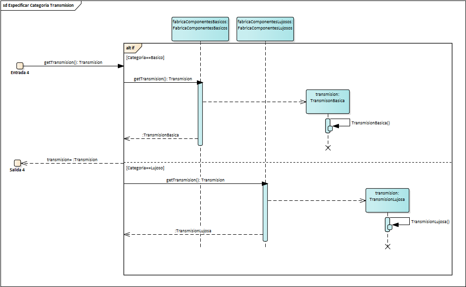

# ModeladoPlataformaConcesionaria
Modelado de plataforma web de concesionaria de vehículos de alta gama, usando UML
Participantes:
## Integrantes

* Cristian Felipe Patiño Caceres - 20141020079
* Cristian David Santoyo Parra - 20141020077 
* Brian Giovanny Alfonso Rodriguez - 20151020600

## Informatica I

### Docente

* Alejandro Paolo Daza 

### Ejercicio

Modelado de plataforma web de concesionaria de vehículos de alta gama, usando UML, la plataforma debe permitir al usuario cambiar la configuración de las partes del vehículo de acuerdo a las posibles existencias para el modelo seleccionado y probar el vehículo en una simulación que informe al usuario sobre: 
- el consumo de combustible.
- la aceleración del vehículo.
- la potencia del motor. 

### Solución 
Con la herramienta **Enterprise Architect** se realiza el modelado UML para el problema realizando Modelos estructurales (Diagrama de clases), Modelos Funcionales (Diagrama de casos de uso) y Modelos de Interaccion (Diagramas de Secuencia, Diagramas de estado) , como se ven ilustrados a continuacion:

# Diagrama de clases

A continuación, el diagrama de clases refleja la solucion expresada para la necesidad de la plataforma web concesonaria, utilizando varios patrones como el **Builder** para creacion de objetos complejos y **Abstract Factory** para la creacion de diferentes tipos de componentes en el auto.

# Diagrama de casos de uso

El diagrma de casosde uso refleja un despliegue de la pagina web para que el usuario pueda interactuar con ella, all tiene varias opciones a escoger lo que desencadena una serie de escenarios para cumplir con la peticion del usuario.

# Diagramas de secuencia

A continuacion son mostrados los diagramas de secuencia para cada uno de los escenarios.

## Desplegar Plataforma Web

Refleja el despliegue en el navegador de los componentes graficos con los que el usuario podra interactuar.

## Construir Auto
___ 

El Usuario oprime el boton para la creacion de un auto.

### Especificar Marca

Dependiendo de la eleccion del usuario se creara un constructor y un auto.

### Construir Motor
___
Refleja la creacion de un motor dependiendo de la eleccion de un usuario.

#### Especificar Categoria Motor

Dependiendo de la eleccion del usuario se creara un motor.

 

### Construir Neumaticos
___
Refleja la creacion de los neumaticos dependiendo de la eleccion de un usuario.

#### Especificar Categoria Neumaticos

Dependiendo de la eleccion del usuario se creara los Neumaticos.

### Construir Transmision
___
Refleja la creacion de la Transmision dependiendo de la eleccion de un usuario.

#### Especificar Categoria Transmision

Dependiendo de la eleccion del usuario se creara la Transmision.

___

## Probar Auto
___
El usuario oprime el boton ProbarAuto y se encadena un simulacion del rendimiento de este dependiendo de sus componentes.

### Realizar Simulacion del Auto

Se calucula el rendimiento del auto en base a 3 propiedades como la **Potencia del motor**, **Aceleracion**, **Consumo de Combustible**, y esto dependera del tipo de componente que tenga el carro.

### Mostrar Rendimiento del Auto
___
Una vez calculadas las propiedades del auto se obtiene los atributos del auto y se genera un informe que sera mostrado al usuario.

#### Obtener Informe del Estado del Auto

Una vez creado el reporte se obtiene para ser mostrado al usuario.

___

## Modificar Tipo de Motor
___

Cuando el usuario ha creado un auto tiene la posibilidad de cambiar el motor, para esto oprime el boton ModificarMotor.

## Modificar Neumaticos
___

Cuando el usuario ha creado un auto tiene la posibilidad de cambiar los Neumaticos, para esto oprime el boton ModificarNeumaticos.

## Modificar Transmision
___

Cuando el usuario ha creado un auto tiene la posibilidad de cambiar la transmision, para esto oprime el boton ModificarTransmision.

# Diagrama de estados

